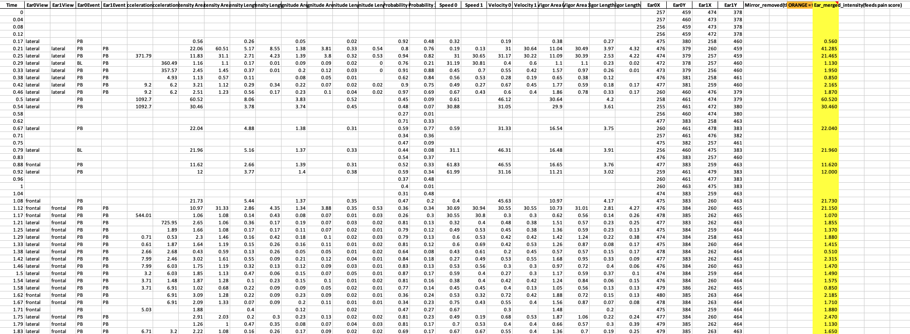
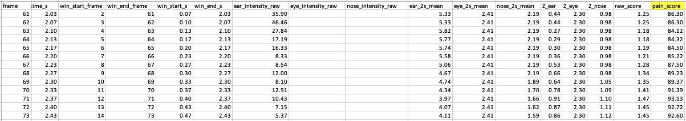
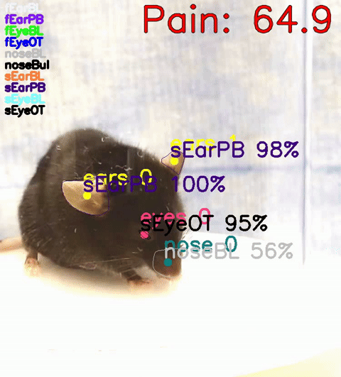
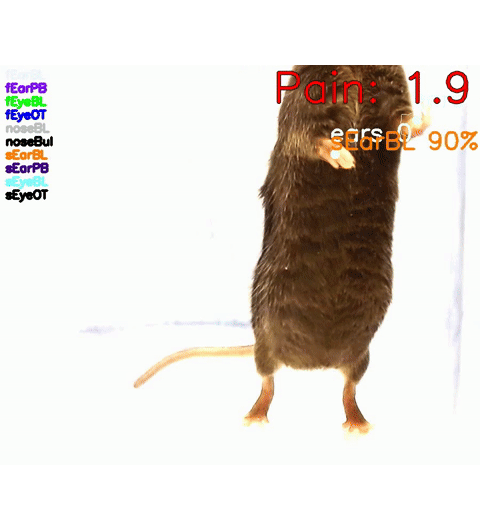
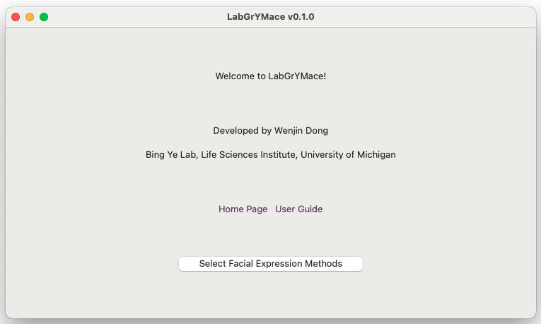

# LabGrymace

**LabGrymace** (LabGym + *grimace*) is an open-source tool for **quantifying pain-related facial expressions in freely moving mice**.

- **Objective and reproducible** — Facial grimace is a widely used indicator of pain in mice, but manual scoring is labor-intensive and subjective. LabGrymace automatically quantifies pain-related facial movements from the tracking output generated by [LabGym](https://github.com/umyelab/LabGym).
- **A biologically calibrated pain score** — Ear, eye, and nose movements are integrated into a single **pain score** that is continuous over time and calibrated to biological reference points, which enables quantitative comparisons across animals and experiments.
- **Easy to use** — A point-and-click GUI generates summary spreadsheets, computes pain scores, and produces annotated videos with the score displayed on every frame. No programming required.

This repository contains two parts: 
- **[`LabGrymace`](LabGrymace)**, the graphical application for pain-score computation and visualization.
- **[`LabGym_LabGrymace`](LabGym)**, a modified version of LabGym 2.9.0, which performs facial region tracking and generates the input files used by LabGrymace.

---

## The outputs of LabGrymace:

**1. Summary spreadsheets** — Three Excel files (`ear_summary.xlsx`, `eye_summary.xlsx`, `nose_summary.xlsx`) containing frame-by-frame measurements for each facial region. Frames removed by the mirror-reflection filter are highlighted in **orange**, and the merged measurements used for pain-score calculation are highlighted in **yellow**.



**2. Pain score analysis** 

The analysis includes:
- **`pain_scores.xlsx`** — one row per 100 s window, plus a `Summary` sheet with each recording's overall score.
- **`pain_scores_per_frame.xlsx`** — a pain score for every frame, each computed over the preceding 2 s.
- **`pain_score_chart.png`** — a dot plot of the batch, one point per recording.



**3. Annotated video**

An `.mp4` copy of the original recording with the continuously updated pain score overlaid on each frame, allowing direct comparison between the quantified pain score and the animal's behavior.

Below is an example comparing a mouse experiencing chemical-induced pain (high pain score) with a baseline mouse (low pain score):

| Pain | No pain |
|:---:|:---:|
|  |  |

---

## Installation

Requires **Python 3.10** (Python 3.9 and 3.11 are also supported). 

> **Use a dedicated environment—never install into the conda `base` environment.**
> LabGrymace depends on specific versions of TensorFlow and NumPy. Installing it into a shared environment may downgrade these packages and break other software. Create a dedicated environment before installing and make sure it is **active** (your prompt shows its name, e.g. `(.venv)` or `(labgrymace)`) before running `pip install`.
>
> If you use Miniconda or Anaconda, a named conda environment is the most reliable choice:
>
> ```bash
> conda create -n labgrymace python=3.10 -y
> conda activate labgrymace
> ```
>
> Then run the two `pip install` lines below inside it (skip the `venv` step).

### macOS

```bash
git clone https://github.com/devindwj0304/LabGym-LabGrymace.git
cd LabGym-LabGrymace
python3 -m venv .venv
source .venv/bin/activate
pip install --upgrade pip
pip install .
pip install ./LabGym
```

This installs two commands: **`LabGrymace`** (the pain tool) and **`LabGym_LabGrymace`**
(our modified LabGym build). On Apple Silicon (M1–M4), use a native **arm64** Python from
<https://www.python.org/downloads/macos/>. Running under Rosetta may prevent TensorFlow from installing or running correctly.

### Windows

Install Python from <https://www.python.org/downloads/windows/> and select **"Add python.exe to PATH"** during installation. Then open **PowerShell** and run:

```powershell
git clone https://github.com/devindwj0304/LabGym-LabGrymace.git
cd LabGym-LabGrymace
python -m venv .venv
.venv\Scripts\activate
pip install --upgrade pip
pip install .
pip install ./LabGym
```

This installs two commands: **`LabGrymace`** (the pain tool) and **`LabGym_LabGrymace`**
(our modified LabGym build). 

If PowerShell blocks environment activation, run the following command once, then try again:
`Set-ExecutionPolicy -Scope CurrentUser RemoteSigned`.

> **The `LabGym_LabGrymace` build is required — not optional.** LabGrymace reads output generated only by this modified LabGym 2.9.0 build. The latest `LabGym` (v3.x) is **not compatible**. Because the two packages have different names, they can be installed side by side. See [Two LabGyms, side by side](docs/LABGYM_CHANGES.md#two-labgyms-side-by-side).

**Models are not included.** The trained detectors and categorizers are ~2 GB and exceed
GitHub's file-size limit.

> **Model download:** *Coming soon.*

Place a detector under `LabGym/LabGym_LabGrymace/detectors/` and a categorizer under
`LabGym/LabGym_LabGrymace/models/`, then select it in the GUI.

---

## Usage

### Launching

Activate your virtual environment first. Two GUI applications are installed 
- **`LabGrymace`**: computes pain scores from LabGym output.
- **`LabGym_LabGrymace`**: our modified LabGym build that generates the tracking output used by LabGrymace.
 
Launch them from the command line:

```bash
LabGrymace
LabGym_LabGrymace
```

If either command is not found (usually because your virtual environment is not on the PATH), launch it through Python instead:

```bash
python -m LabGrymace
python -m LabGym_LabGrymace
```

> **The two applications run independently.** `LabGrymace` opens immediately. 
> **`LabGym_LabGrymace` typically takes 10–30 seconds to start** the first time because it loads TensorFlow and Detectron2 before the GUI appears.



The **`LabGrymace`** workflow consists of two steps:

1. **Generate summary files** — Select the folder containing the LabGym output. LabGrymace generates `ear_summary.xlsx`, `eye_summary.xlsx`, and `nose_summary.xlsx` files for each recording.
2. **Compute pain scores** — Select the folders containing the summary files. LabGrymace generates `pain_scores.xlsx`, `pain_scores_per_frame.xlsx`, `pain_score_chart.png`, and (optionally) an annotated video with pain score overlaid on each frame.

The reflection filter is **disabled by default** and can be enabled with a checkbox during step 2. The figures in the accompanying manuscript were generated with this filter enabled, and the reproduction scripts set it automatically.

## Advanced usage

Most users will use the graphical interface, but the core functions can also be called from the command line or imported into Python scripts.

### Command line

Generate summary files from a folder containing LabGym output:

```bash
python -m LabGrymace.loaddata "/path/to/folder/of/LabGym/datasets"
```

```python
import numpy as np
from LabGrymace.gui_main import load_raw_data, compute_per_frame_pain_scores

data  = load_raw_data("/path/to/one/animal/folder")
score = float(np.nanmean(compute_per_frame_pain_scores(data, lookback=60)))
print("overall pain score:", round(score, 2))
```

---

## Documentation

- **[How LabGym_LabGrymace differs from upstream](docs/LABGYM_CHANGES.md)** — describes the modifications made to LabGym and identifies those that affect results.

---

## License
LabGrymace is licensed under **GPL-3.0** (see [`LICENSE`](LICENSE)).

This repository includes a modified version of **LabGym** (Ye Lab, University of Michigan), which is licensed under **GPL-3.0**. The original attribution and license are preserved in [`LabGym/LICENSE.txt`](LabGym/LICENSE.txt).

If you use LabGrymace in published research, please cite both **LabGrymace** and **LabGym**.
